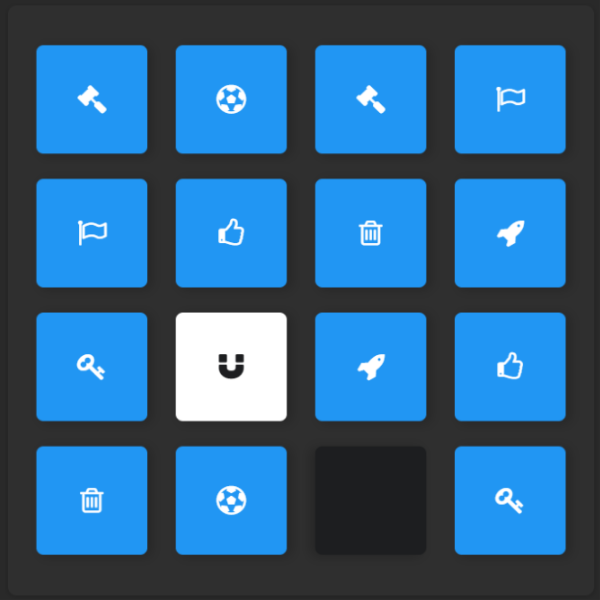

# Memory Game Project - Udacity

This is a project for the Udacity Front-End Nanodegree called **Memory Game**.

Check out this project on [GitHub Pages](https://al-yasa.github.io/Memory-Game-Project-Udacity/ "Memory Game - Belhenniche Al-Yasa'").

## Description

### Built With

- Icons from [Font Awesome](https://fontawesome.com/).
- Sounds from [OpenGameArt](https://opengameart.org/).

### Game

Memory Game also known as Concentration is a card game in which all of the cards are laid face down and two cards are flipped face up over each turn.

There are 16 cards laid on a 4x4 grid board, only 2 cards have the same symbol which amounts to the total of 8 pairs.

The objective of the game is to turn over all pairs of matching cards.

## Instructions

### How to Play

At the start of the game, all cards will turn face up for 2 seconds then they will be put face down again.

Select a card and remember the symbol on it then with the next selection try to find the card with same symbol.

- You win after all cards are paired and face up.
- You will lose a star if you use more then one hint.
- You will lose a star if you reach 12 moves.
- You will lose two stars if you reach 18 moves.
- You will lose a star if you reach 30 seconds.
- You will lose two stars if you reach 1 minute.
- You can play with a Mouse or a Keyboard.

### Keyboard Shortcuts

- Use arrow keys to select a card.
- Press Enter or Spacebar to flip a card.
- Press R to restart the game.
- Press H to use a hint.